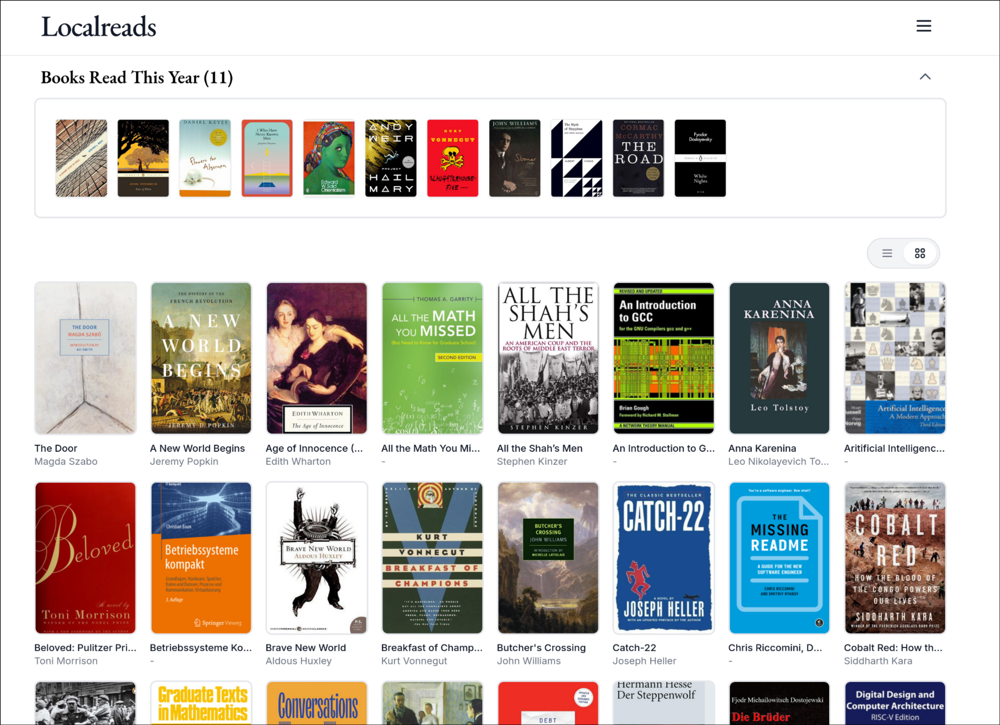
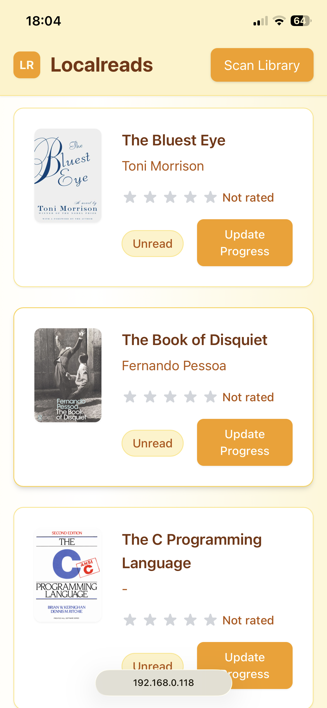

# Localreads

A local reading progress tracker for your ebook collection. Track reading progress, rate books, and manage your library - all locally.

<p align="center">
  
  
</p>

## Features

- Track reading progress for EPUB and PDF files
- Star ratings and reviews
- Automatic book cover and EPUB metadata extraction
- Responsive design for desktop and mobile
- Local storage - no cloud required

## Tech Stack

**Frontend:** React, Vite, Tailwind CSS  
**Backend:** FastAPI, SQLite, SQLModel

## Setup

1. **Backend:**
```bash
cd backend
python -m venv venv
source venv/bin/activate
pip install -r requirements.txt
uvicorn app.main:app --reload --host 0.0.0.0 --port 8000
```

2. **Frontend:**
```bash
cd frontend
npm install
npm run dev -- --host
```
3. **Access**: http://localhost:3000 or http://[your-ip]:3000 from other devices.
---
#### TODO
- Scan subfolders in books path
- Improve UI design
- Add search and filtering
- Sync progress with KoReader on Kindle
- Add more sorting options
